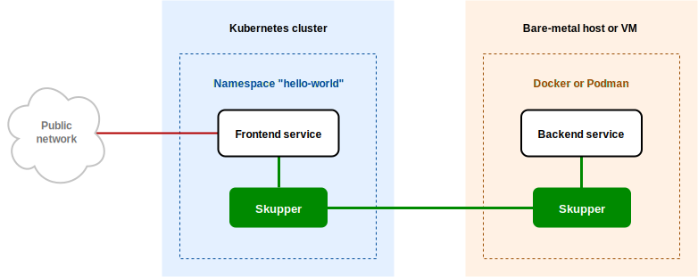

# Skupper Hello World Docker

#### A minimal HTTP application deployed across Kubernetes and Docker sites using Skupper

This example is part of a [suite of examples][examples] showing the
different ways you can use [Skupper][website] to connect services
across cloud providers, data centers, and edge sites.

[website]: https://skupper.io/
[examples]: https://skupper.io/examples/index.html

#### Contents

* [Overview](#overview)
* [Prerequisites](#prerequisites)
* [Step 1: Install the Skupper command-line tool](#step-1-install-the-skupper-command-line-tool)
* [Step 2: Access your Kubernetes cluster](#step-2-access-your-kubernetes-cluster)
* [Step 3: Set up your Kubernetes namespace](#step-3-set-up-your-kubernetes-namespace)
* [Step 4: Install Skupper in your Kubernetes namespace](#step-4-install-skupper-in-your-kubernetes-namespace)
* [Step 5: Deploy and expose the backend on your local machine](#step-5-deploy-and-expose-the-backend-on-your-local-machine)
* [Step 6: Deploy and expose the frontend on Kubernetes](#step-6-deploy-and-expose-the-frontend-on-kubernetes)
* [Step 7: Test the application](#step-7-test-the-application)
* [Accessing the web console](#accessing-the-web-console)
* [Cleaning up](#cleaning-up)
* [About this example](#about-this-example)

## Overview

This example is a very simple multi-service HTTP application
deployed across a Kubernetes cluster and a bare-metal host or VM
running Docker containers.

It contains two services:

* A backend service that exposes an `/api/hello` endpoint.  It
  returns greetings of the form `Hi, <your-name>.  I am <my-name>
  (<pod-name>)`.

* A frontend service that sends greetings to the backend and
  fetches new greetings in response.

With Skupper, you can run the backend as a container on your local
machine and the frontend in Kubernetes and maintain connectivity
between the two services without exposing the backend to the public
internet.

<!--  -->

## Prerequisites

* A working installation of Docker ([installation
  guide][install-docker]) or Podman ([installation
  guide][install-podman])

* The `kubectl` command-line tool, version 1.15 or later
  ([installation guide][install-kubectl])

* Access to a Kubernetes cluster, from [any provider you
  choose][kube-providers]

[install-docker]: https://docs.docker.com/engine/install/
[install-podman]: https://podman.io/getting-started/installation
[install-kubectl]: https://kubernetes.io/docs/tasks/tools/install-kubectl/
[kube-providers]: https://skupper.io/start/index.html#prerequisites

## Step 1: Install the Skupper command-line tool

The `skupper` command-line tool is the primary entrypoint for
installing and configuring Skupper.  You need to install the
`skupper` command only once for each development environment.

On Linux or Mac, you can use the install script (inspect it
[here][install-script]) to download and extract the command:

~~~ shell
curl https://skupper.io/install.sh | sh
~~~

The script installs the command under your home directory.  It
prompts you to add the command to your path if necessary.

For Windows and other installation options, see [Installing
Skupper][install-docs].

[install-script]: https://github.com/skupperproject/skupper-website/blob/main/docs/install.sh
[install-docs]: https://skupper.io/install/index.html

## Step 2: Access your Kubernetes cluster

The procedure for accessing a Kubernetes cluster varies by
provider. Find the instructions for your chosen provider and use
them to authenticate and configure access for each console
session.  See the following links for more information:

* [Minikube](https://skupper.io/start/minikube.html)
* [Amazon Elastic Kubernetes Service (EKS)](https://skupper.io/start/eks.html)
* [Azure Kubernetes Service (AKS)](https://skupper.io/start/aks.html)
* [Google Kubernetes Engine (GKE)](https://skupper.io/start/gke.html)
* [IBM Kubernetes Service](https://skupper.io/start/ibmks.html)
* [OpenShift](https://skupper.io/start/openshift.html)
* [More providers](https://kubernetes.io/partners/#kcsp)

## Step 3: Set up your Kubernetes namespace

Use `kubectl create namespace` to create the namespace you wish
to use (or use an existing namespace).  Use `kubectl config
set-context` to set the current namespace for your session.

_**Console for hello-world:**_

~~~ shell
kubectl create namespace hello-world
kubectl config set-context --current --namespace hello-world
~~~

_Sample output:_

~~~ console
$ kubectl create namespace hello-world
namespace/hello-world created

$ kubectl config set-context --current --namespace hello-world
Context "minikube" modified.
~~~

## Step 4: Install Skupper in your Kubernetes namespace

The `skupper init` command installs the Skupper router and service
controller in the current namespace.

**Note:** If you are using Minikube, [you need to start `minikube
tunnel`][minikube-tunnel] before you install Skupper.

[minikube-tunnel]: https://skupper.io/start/minikube.html#running-minikube-tunnel

_**Console for hello-world:**_

~~~ shell
skupper init
~~~

_Sample output:_

~~~ console
$ skupper init
Waiting for LoadBalancer IP or hostname...
Skupper is now installed in namespace 'hello-world'.  Use 'skupper status' to get more information.
~~~

## Step 5: Deploy and expose the backend on your local machine

Use `docker` to run the backend service on your local machine.

Use the `skupper gateway expose` command to expose the backend
on the Skupper network.  Use `kubectl get service/backend` to
ensure the backend service is available.

_**Console for hello-world:**_

~~~ shell
docker run --name backend --detach --rm -p 8080:8080 quay.io/skupper/hello-world-backend
skupper gateway expose backend localhost 8080 --type docker
kubectl get service/backend
~~~

_Sample output:_

~~~ console
$ docker run --name backend --detach --rm -p 8080:8080 quay.io/skupper/hello-world-backend
262dde0287af2c76c3088d9ff4f865f02732a762b0afd91e03ec9e3fe6b03f88

$ skupper gateway expose backend localhost 8080 --type docker
2022/08/26 07:27:11 CREATE io.skupper.router.tcpConnector fancypants-jross-egress-backend:8080 map[address:backend:8080 host:localhost name:fancypants-jross-egress-backend:8080 port:8080 siteId:f1e916db-8786-4bad-81ce-f1d3531179f0]

$ kubectl get service/backend
NAME      TYPE        CLUSTER-IP     EXTERNAL-IP   PORT(S)    AGE
backend   ClusterIP   10.101.76.37   <none>        8080/TCP   10s
~~~

## Step 6: Deploy and expose the frontend on Kubernetes

Use `kubectl create deployment` to deploy the frontend service
in `hello-world`.

Use `kubectl expose` with `--type LoadBalancer` to open network
access to the frontend service.

_**Console for hello-world:**_

~~~ shell
kubectl create deployment frontend --image quay.io/skupper/hello-world-frontend
kubectl expose deployment/frontend --port 8080 --type LoadBalancer
~~~

_Sample output:_

~~~ console
$ kubectl create deployment frontend --image quay.io/skupper/hello-world-frontend
deployment.apps/frontend created

$ kubectl expose deployment/frontend --port 8080 --type LoadBalancer
service/frontend exposed
~~~

## Step 7: Test the application

Now we're ready to try it out.  Use `kubectl get service/frontend`
to look up the external IP of the frontend service.  Then use
`curl` or a similar tool to request the `/api/health` endpoint at
that address.

**Note:** The `<external-ip>` field in the following commands is a
placeholder.  The actual value is an IP address.

_**Console for hello-world:**_

~~~ shell
kubectl get service/frontend
curl http://<external-ip>:8080/api/health
~~~

_Sample output:_

~~~ console
$ kubectl get service/frontend
NAME       TYPE           CLUSTER-IP      EXTERNAL-IP     PORT(S)          AGE
frontend   LoadBalancer   10.103.232.28   <external-ip>   8080:30407/TCP   15s

$ curl http://<external-ip>:8080/api/health
OK
~~~

If everything is in order, you can now access the web interface by
navigating to `http://<external-ip>:8080/` in your browser.

## Accessing the web console

Skupper includes a web console you can use to view the application
network.  To access it, use `skupper status` to look up the URL of
the web console.  Then use `kubectl get
secret/skupper-console-users` to look up the console admin
password.

**Note:** The `<console-url>` and `<password>` fields in the
following output are placeholders.  The actual values are specific
to your environment.

_**Console for hello-world:**_

~~~ shell
skupper status
kubectl get secret/skupper-console-users -o jsonpath={.data.admin} | base64 -d
~~~

_Sample output:_

~~~ console
$ skupper status
Skupper is enabled for namespace "hello-world" in interior mode. It is connected to 1 other site. It has 1 exposed service.
The site console url is: <console-url>
The credentials for internal console-auth mode are held in secret: 'skupper-console-users'

$ kubectl get secret/skupper-console-users -o jsonpath={.data.admin} | base64 -d
<password>
~~~

Navigate to `<console-url>` in your browser.  When prompted, log
in as user `admin` and enter the password.

## Cleaning up

To remove Skupper and the other resources from this exercise, use
the following commands.

_**Console for hello-world:**_

~~~ shell
docker stop backend
skupper gateway delete
skupper delete
kubectl delete service/frontend
kubectl delete deployment/frontend
~~~

## Next steps

Check out the other [examples][examples] on the Skupper website.

## About this example

This example was produced using [Skewer][skewer], a library for
documenting and testing Skupper examples.

[skewer]: https://github.com/skupperproject/skewer

Skewer provides some utilities for generating the README and running
the example steps.  Use the `./plano` command in the project root to
see what is available.

To quickly stand up the example using Minikube, try the `./plano demo`
command.
